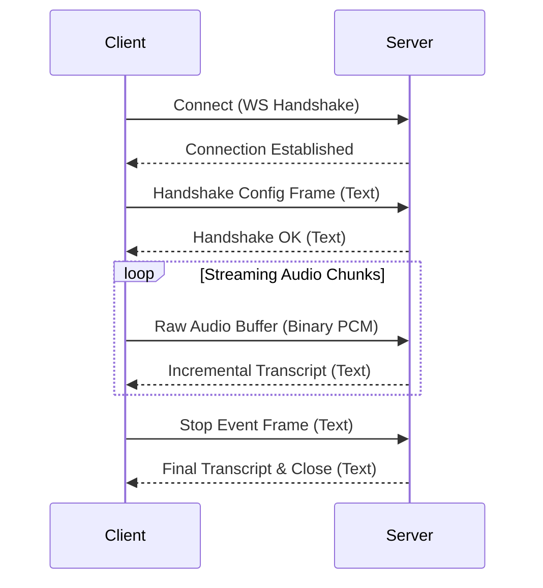

# WebSocket API Contract: VietASR Core System

This document defines the WebSocket protocol and frame schemas for real-time streaming speech recognition.

---

## 1. WebSocket Streaming Endpoint

Establishes a low-latency persistent connection to stream microphone or raw audio chunks and receive incremental transcript updates.

- **URL**: `/api/stream`
- **Protocol**: `WS` / `WSS`

---

## 2. Protocol Flow



---

## 3. Frame Schemas

### 3.1. Client Handshake Config Frame (Text)
Must be the first frame sent by the client. Sets the runtime parameters for the streaming session.

```json
{
  "event": "handshake",
  "config": {
    "method": "greedy_search",
    "causal": true,
    "chunk_size": 16,
    "left_context_frames": 128
  }
}
```

### 3.2. Server Handshake OK Frame (Text)
Returned by the server to confirm successful initialization.

```json
{
  "event": "handshake_ok",
  "session_id": "ws_sess_8c207d19-4bf9-4bc7"
}
```

### 3.3. Client Audio Data Frame (Binary)
Client transmits binary frames containing raw audio data chunks in **16kHz, mono, 16-bit PCM WAV (or raw PCM)** format. It is recommended to send chunks matching the `chunk_size` specified in the handshake configuration (typically 100ms to 200ms worth of audio samples per frame).

### 3.4. Server Transcript Update Frame (Text)
Server returns incremental transcriptions as audio chunks are processed.

```json
{
  "event": "transcript_update",
  "text": "chào mừng bạn",
  "is_final": false,
  "confidence": 0.94
}
```

When a complete semantic sentence or long pause is detected, the server returns the final segment:
```json
{
  "event": "transcript_update",
  "text": "chào mừng bạn đến với hệ thống.",
  "is_final": true,
  "confidence": 0.96
}
```

### 3.5. Client Stop Frame (Text)
Sent by the client when they finish speaking to indicate end-of-stream.

```json
{
  "event": "stop"
}
```

### 3.6. Server Finished Frame (Text)
Sent by the server in response to a Client Stop frame, containing the complete transcription summary before closing the WebSocket connection.

```json
{
  "event": "finished",
  "full_transcript": "chào mừng bạn đến với hệ thống.",
  "confidence": 0.958
}
```
---

## 4. Connection Failures & Timeouts
- **Inactive Handshake**: If the client connects but does not transmit a valid `handshake` text frame within 5.0 seconds, the server will close the connection with status code `1008` (Policy Violation).
- **Network Interruptions**: If the client connection terminates abruptly, the server discards the session memory and persists any complete transcripts.
