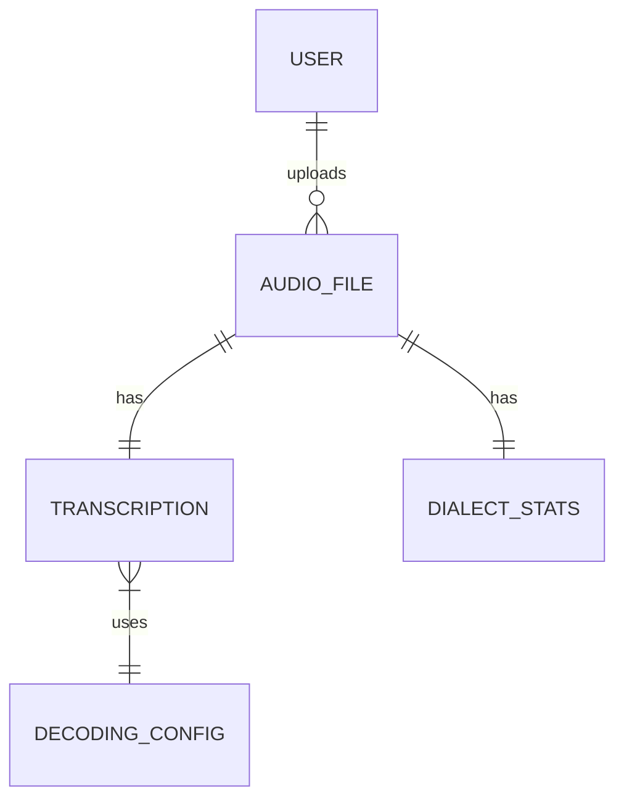
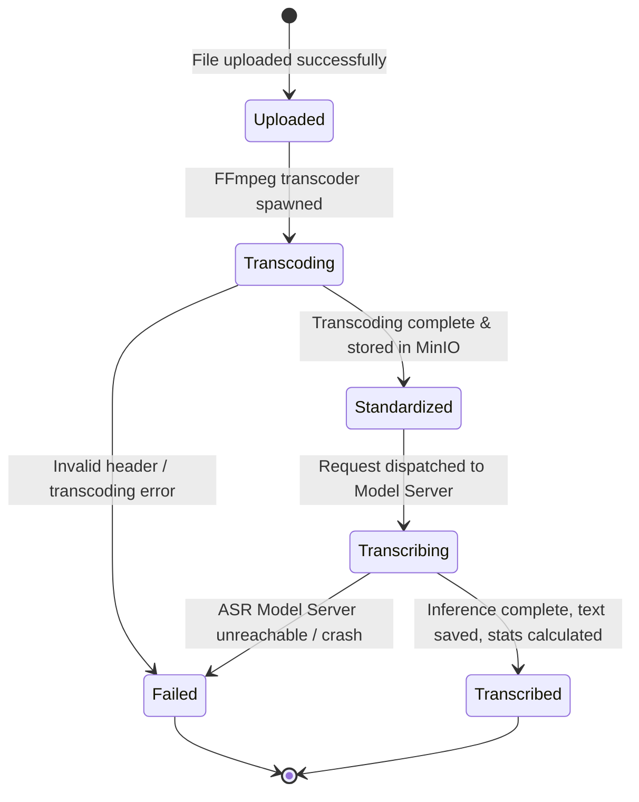

# Data Model: VietASR Core System

This document specifies the database schemas, entity relationships, and validation rules for the VietASR database layer.

---

## 1. Entity-Relationship Diagram

---

## 2. Entity Details & Schemas

### 2.1. User
Represents system users accessing the application.

| Field | Type | Constraints | Description |
|---|---|---|---|
| `id` | UUID | Primary Key | Unique identifier. |
| `username` | VARCHAR(50) | Unique, Not Null | Username for authentication. Length: 3-50 characters. |
| `password_hash` | VARCHAR(255) | Not Null | Hashed password. |
| `created_at` | TIMESTAMP | Not Null | Time of registration. |

### 2.2. AudioFile
Tracks details of uploaded audio and video binaries.

| Field | Type | Constraints | Description |
|---|---|---|---|
| `id` | UUID | Primary Key | Unique identifier. |
| `user_id` | UUID | Foreign Key -> User(id), Nullable | The user who uploaded the file. |
| `raw_storage_path` | VARCHAR(512) | Not Null | Storage path for the original file in MinIO (e.g. `s3://raw-uploads/filename.mp3`). |
| `standard_storage_path` | VARCHAR(512) | Not Null | Storage path for the transcoded WAV file in MinIO. |
| `original_format` | VARCHAR(10) | Not Null | File format. Validation: Must be in `['wav', 'mp3', 'flac', 'm4a', 'ogg', 'mp4']`. |
| `duration_seconds` | FLOAT | Not Null | Duration of the audio. Validation: `> 0`. |
| `size_bytes` | BIGINT | Not Null | File size. Validation: `> 0` and `<= 52428800` (50MB). |
| `created_at` | TIMESTAMP | Not Null | Time of upload. |

### 2.3. DecodingConfig
Stores configuration variables used during the inference run.

| Field | Type | Constraints | Description |
|---|---|---|---|
| `id` | UUID | Primary Key | Unique identifier. |
| `method` | VARCHAR(30) | Not Null | Decoding algorithm. Validation: `greedy_search` or `modified_beam_search`. |
| `beam_size` | INTEGER | Nullable | Search beam size. Validation: `1` to `20`. Null if greedy search is used. |
| `causal` | BOOLEAN | Not Null | Causal decoding flag. |
| `chunk_size` | INTEGER | Nullable | Size of chunks for streaming inference. |
| `left_context_frames` | INTEGER | Nullable | History frame buffer size. |
| `created_at` | TIMESTAMP | Not Null | Record creation time. |

### 2.4. Transcription
Stores the final recognized text and confidence metadata.

| Field | Type | Constraints | Description |
|---|---|---|---|
| `id` | UUID | Primary Key | Unique identifier. |
| `audio_file_id` | UUID | Foreign Key -> AudioFile(id), Unique | Reference to the audio. |
| `decoding_config_id` | UUID | Foreign Key -> DecodingConfig(id) | Config used during recognition. |
| `text` | TEXT | Not Null | Recognized Vietnamese transcript. |
| `confidence` | FLOAT | Not Null | Model confidence. Validation: `0.0` to `1.0`. |
| `word_alignments` | JSONB | Nullable | JSON list containing token alignments: `[{"word": "xin", "start": 0.12, "end": 0.35, "conf": 0.98}, ...]`. |
| `created_at` | TIMESTAMP | Not Null | Timestamp of completion. |

### 2.5. DialectStats
Tracks routing and accuracy heuristics per regional accent.

| Field | Type | Constraints | Description |
|---|---|---|---|
| `id` | UUID | Primary Key | Unique identifier. |
| `audio_file_id` | UUID | Foreign Key -> AudioFile(id), Unique | Reference to the audio. |
| `inferred_dialect` | VARCHAR(15) | Not Null | Classified accent. Validation: `NORTHERN`, `CENTRAL`, `SOUTHERN`. |
| `dialect_probability` | FLOAT | Not Null | Classification confidence. Validation: `0.0` to `1.0`. |
| `wer_estimate` | FLOAT | Nullable | Estimated Word Error Rate if labeled reference text was supplied. |
| `created_at` | TIMESTAMP | Not Null | Classification timestamp. |

---

## 3. State Transitions

The state flow of an audio processing lifecycle is as follows:

