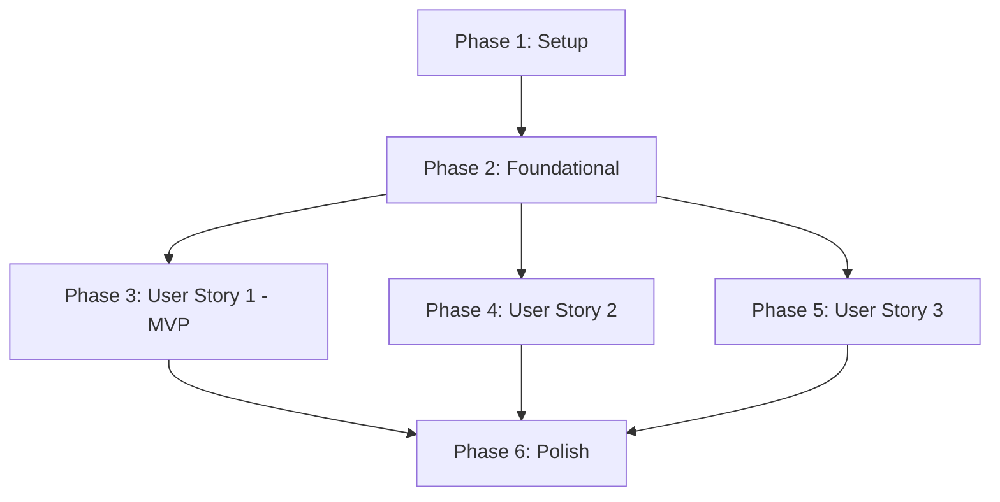

# Tasks: VietASR Core System

**Input**: Design documents from `specs/001-vietasr-core-system/`

**Prerequisites**: plan.md (required), spec.md (required), research.md, data-model.md, contracts/

**Tests**: Verification commands are documented in quickstart.md. Automated testing framework setup tasks are optional.

**Organization**: Tasks are grouped by user story to enable independent implementation and testing of each story.

---

## Phase 1: Setup (Shared Infrastructure)

**Purpose**: Project initialization and basic container orchestration.

- [x] T001 Initialize monorepo workspace and create basic folder structure (`apps/`, `docker/`, `docs/`)
- [x] T002 [P] Initialize PostgreSQL and MinIO container services in `docker/docker-compose.yml`
- [x] T003 [P] Create environment files `apps/web-backend/.env` and `apps/asr-server/.env` with local secrets and CORS domains
- [x] T004 [P] Configure pre-commit scripts and clean scripts to purge k2 C++ caches and Python bytecode folders in `scripts/clean.sh`

---

## Phase 2: Foundational (Blocking Prerequisites)

**Purpose**: Core application initialization and database domain mapping.

**⚠️ CRITICAL**: No user story work can begin until this phase is complete.

- [x] T005 [P] Initialize FastAPI ASR Model Server app structure with dependencies in `apps/asr-server/pyproject.toml`
- [x] T006 [P] Initialize FastAPI Web Backend app structure with Clean Architecture directories in `apps/web-backend/pyproject.toml`
- [x] T007 [P] Initialize React SPA client structure with Vite, TailwindCSS, and TypeScript dependencies in `apps/web-frontend/package.json`
- [x] T008 Implement database engine connection lifecycle and session parameters in `apps/web-backend/src/frameworks/database.py`
- [x] T009 Implement core business Domain Entities (`User`, `AudioFile`, `Transcription`, `DecodingConfig`, `DialectStats`) in `apps/web-backend/src/domain/entities.py`
- [x] T010 Implement abstract Repository interfaces (DB and Storage ports) in `apps/web-backend/src/domain/interfaces.py`
- [x] T011 Implement database schema mappings and migrations using SQLAlchemy in `apps/web-backend/src/adapters/database/sqlalchemy_models.py`
- [x] T012 Implement asynchronous MinIO client gateway adapter in `apps/web-backend/src/adapters/storage/minio_client.py`

**Checkpoint**: Foundation ready - user story implementation can now begin in parallel.

---

## Phase 3: User Story 1 - Multi-format Batch Audio Upload & Transcription (Priority: P1) 🎯 MVP

**Goal**: Upload audio/video, transcode via FFmpeg, store in MinIO/Postgres, fetch transcript from model server, return text.

**Independent Test**: Can be validated by executing upload CURL commands as documented in `quickstart.md#41-scenario-1-batch-upload-and-audio-transcoding-p1-verification`.

- [x] T013 [P] [US1] Implement ASR Client connection interface and HTTP client class in `apps/web-backend/src/adapters/asr_client/http_client.py`
- [x] T014 [US1] Load checkpoints and expose batch inference endpoint in `apps/asr-server/src/main.py`
- [x] T015 [US1] Implement asynchronous FFmpeg transcoding subprocess logic in `apps/web-backend/src/usecases/audio_process.py`
- [x] T016 [US1] Implement TranscribeAudioUseCase coordinating file validation, transcoding, S3 uploads, ASR client requests, and repository logs in `apps/web-backend/src/usecases/transcribe.py`
- [x] T017 [US1] Implement upload request handler, validators, and size limits (50MB) in `apps/web-backend/src/adapters/controllers/upload_controller.py`
- [x] T018 [US1] Expose upload API route in `apps/web-backend/src/frameworks/routes/audio_routes.py` and bind routes to FastAPI app in `apps/web-backend/src/frameworks/main.py`
- [x] T019 [P] [US1] Create React HTTP API client wrapper in `apps/web-frontend/src/services/api_client.ts`
- [x] T020 [US1] Create Batch Audio Uploader page in `apps/web-frontend/src/components/AudioUploader.tsx`

**Checkpoint**: User Story 1 (MVP) is fully functional and testable.

---

## Phase 4: User Story 2 - Dynamic Decoding Configuration (Priority: P2)

**Goal**: Adjust search configurations on the client UI and apply them instantly at runtime.

**Independent Test**: Verified by invoking batch uploads with different configuration payloads as detailed in `quickstart.md#42-scenario-2-dynamic-decoding-parameter-verification-p2-verification`.

- [x] T021 [US2] Map dynamic parameters to k2 decoding search space inputs in `apps/asr-server/src/models/k2_decoder.py`
- [x] T022 [US2] Update upload REST handler to deserialize decoding options and relay parameters to model server in `apps/web-backend/src/adapters/controllers/upload_controller.py`
- [ ] T023 [US2] Implement ASR Config Panel UI component in `apps/web-frontend/src/components/ASRConfigPanel.tsx`
- [ ] T024 [US2] Connect configuration panel states to the API requests in `apps/web-frontend/src/services/api_client.ts`

**Checkpoint**: User Stories 1 and 2 are fully integrated and functional.

---

## Phase 5: User Story 3 - Real-Time Streaming Speech Recognition (Priority: P3)

**Goal**: Establish WebSocket tunnels to stream microphone buffers and print transcripts in real-time.

**Independent Test**: Verified by executing Websocat streaming tests as documented in `quickstart.md#43-scenario-3-real-time-websocket-streaming-p3-verification`.

- [ ] T025 [P] [US3] Implement bidirectional WebSocket audio chunk decoding endpoint in `apps/asr-server/src/main.py`
- [ ] T026 [US3] Implement WebSocket stream relayer and handshake configuration mapper in `apps/web-backend/src/adapters/asr_client/websocket_client.py`
- [ ] T027 [US3] Implement streaming WebSocket endpoint `/api/stream` in `apps/web-backend/src/adapters/controllers/stream_controller.py`
- [ ] T028 [P] [US3] Implement WebSocket connection client in `apps/web-frontend/src/services/websocket_client.ts`
- [ ] T029 [US3] Implement real-time microphone streaming recorder interface in `apps/web-frontend/src/components/AudioStreamer.tsx`

**Checkpoint**: All user stories are independently functional.

---

## Phase 6: Polish & Cross-Cutting Concerns

**Purpose**: System optimizations, error recovery, and dialect classification stats.

- [ ] T030 [P] Implement dialect classification routing logic in `apps/web-backend/src/usecases/dialect_routing.py`
- [ ] T031 Integrate dialect stats metadata tracking into controllers in `apps/web-backend/src/adapters/controllers/upload_controller.py`
- [ ] T032 [P] Implement error-handling and connection recovery adapters for ASR server disconnections in `apps/web-backend/src/adapters/asr_client/http_client.py`
- [ ] T033 Execute docker startup clean commands and run end-to-end tests as documented in `quickstart.md`
- [ ] T034 [P] Synchronize README configurations and deployment logs under `docs/`

---

## Dependencies & Execution Order

### Phase Dependencies



---

## Parallel Execution Examples

### Setup & Foundation Tasks (Terminal Concurrent Runs)
```bash
# Set up Postgres/MinIO while initializing backend config
Task T002: docker-compose -f docker/docker-compose.yml up -d
Task T006: Initialize backend project dependencies
```

### User Story 1 Tasks (Backend client & Frontend API layer)
```bash
# Develop backend connection client and frontend requests in parallel
Task T013: Implement HTTP client connection class in apps/web-backend
Task T019: Create React HTTP API client in apps/web-frontend
```

---

## Implementation Strategy

### MVP First (User Story 1 Only)
1. Complete **Phase 1** Setup.
2. Complete **Phase 2** Foundational modules (PostgreSQL mappings, MinIO clients).
3. Complete **Phase 3** User Story 1 (FFmpeg transcoding and ASR connection).
4. Run validation scenarios from `quickstart.md#41-scenario-1-batch-upload-and-audio-transcoding-p1-verification` to demonstrate MVP readiness.
