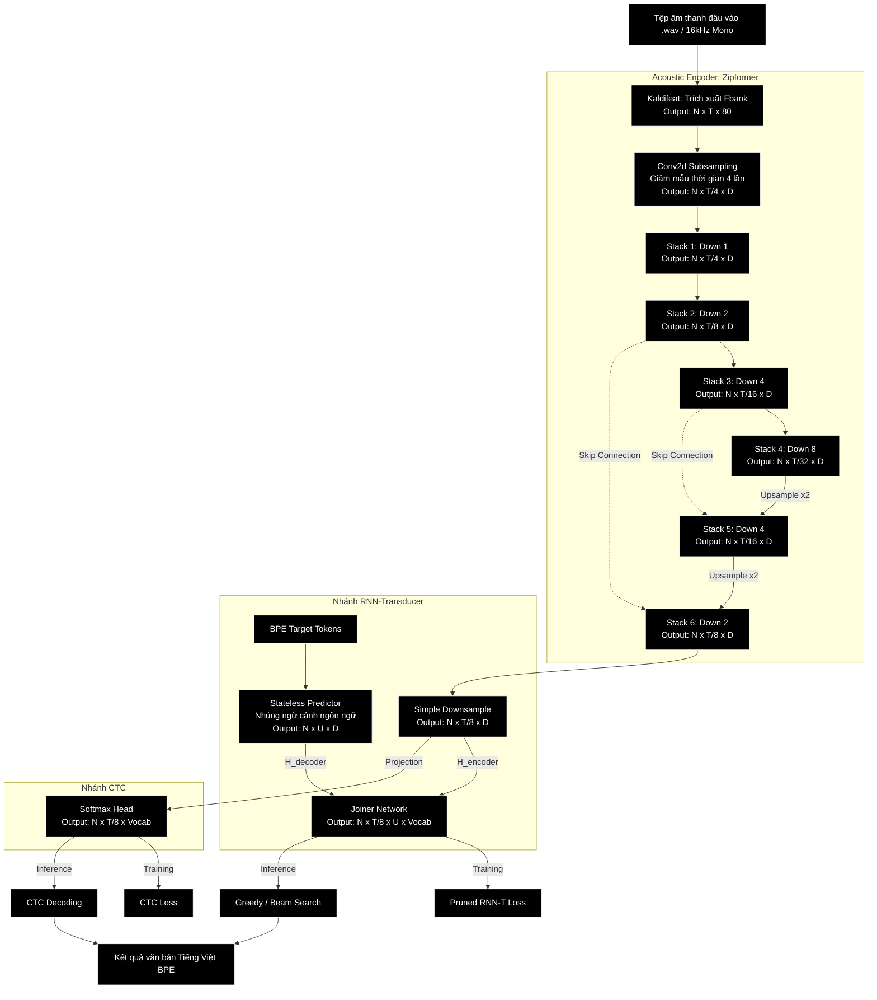

# Kiến Trúc, Chế Độ Chạy và Tham Số Cấu Hình

## 1. Sơ Đồ Kiến Trúc Hệ Thống Chi Tiết

Dưới đây là sơ đồ luồng dữ liệu chi tiết từ file âm thanh đầu vào đến văn bản kết quả, thể hiện cả hai nhánh giải mã **RNN-Transducer (RNN-T)** và **CTC**:

---

## 2. Chi Tiết Các Thành Phần Trong Kiến Trúc

### 2.1. Bộ trích xuất đặc trưng (Feature Extraction - Kaldifeat)
*   **Chức năng**: Chuyển đổi dữ liệu âm thanh dạng sóng thời gian (waveform) thành phổ âm học dạng số.
*   **Chi tiết**: Sử dụng thư viện `kaldifeat` để trích xuất 80 kênh tần số Fbank (Log-mel filter banks). Mỗi khung đặc trưng (frame) được tính toán trên cửa sổ 25ms, bước nhảy khung (frame shift) là 10ms. Tần số lấy mẫu đầu vào bắt buộc là 16kHz.

### 2.2. Bộ mã hóa âm học (Acoustic Encoder - Zipformer)
Zipformer là sự cải tiến vượt bậc so với kiến trúc Conformer truyền thống. Điểm mấu chốt là cấu trúc **U-Net** và cơ chế **Hạ mẫu đa tốc độ (Multi-rate Downsampling)**:
*   **Giảm độ phức tạp tính toán**: Cơ chế tự chú ý (Self-Attention) có độ phức tạp là $O(T^2)$. Bằng cách hạ mẫu thời gian sâu dần từ Stack 1 đến Stack 4 (hạ mẫu 8 lần so với đầu ra subsampling, tương đương 32 lần so với âm thanh gốc), độ phức tạp tính toán của Attention tại đáy chữ U chỉ còn $O(T^2 / 64)$.
*   **Skip Connections**: Các kết nối tắt truyền trực tiếp đặc trưng từ các tầng hạ mẫu tương ứng sang tầng nâng mẫu (ví dụ: Stack 3 sang Stack 5) nhằm giữ nguyên độ phân giải thời gian và các chi tiết âm học tần số cao.

### 2.3. Bộ giải mã ngôn ngữ không trạng thái (Stateless Predictor / Decoder)
*   **Khác biệt với RNN truyền thống**: Thay vì sử dụng LSTM hoặc GRU đệ quy tuần tự (rất chậm và khó chạy song song), VietASR sử dụng một **Stateless Predictor**.
*   **Nguyên lý**: Chỉ sử dụng một lớp nhúng `Embedding` kết hợp với một vài lớp tích chập 1D (`Conv1D`) giới hạn ngữ cảnh trên các token đã biết trước đó. Do không có trạng thái ẩn đệ quy cần truyền qua các bước thời gian, mô hình decoder này chạy cực kỳ nhanh và hỗ trợ tối ưu hóa bộ nhớ đệm tốt hơn trong quá trình Beam Search.

### 2.4. Mạng kết hợp (Joiner Network)
    Kết quả sau đó được đưa qua lớp Softmax để tính phân phối xác suất trên toàn bộ từ điển (BPE tokens).

### 2.5. Nhánh CTC (Connectionist Temporal Classification)
Bên cạnh nhánh Transducer mặc định, hệ thống còn hỗ trợ nhánh CTC phục vụ huấn luyện kết hợp (joint training) hoặc giải mã độc lập:
*   **Nguyên lý**: Nhánh CTC chiếu trực tiếp đầu ra của Encoder $H_{\text{encoder}}$ lên từ điển thông qua một lớp tuyến tính (`nn.Linear`) và tính toán `LogSoftmax` để đưa ra phân phối xác suất độc lập tại từng frame thời gian mà không cần thông qua mạng Decoder (Predictor) hay Joiner.
*   **Đặc điểm**: Tốc độ suy luận rất nhanh và cấu trúc mô hình cực kỳ đơn giản (chỉ sử dụng Acoustic Model), thích hợp cho các thiết bị tài nguyên thấp.

### 2.6. Hàm Tổn Thất (Loss Functions) & Giải Mã Chi Tiết
*   **Pruned RNN-T Loss (smoothed & pruned)**:
    Để vượt qua rào cản tiêu tốn bộ nhớ GPU theo cấp số nhân $O(T \times U \times V)$ của RNN-T truyền thống, thuật toán Pruned RNN-T Loss trong `k2`/`icefall` thực hiện cắt tỉa theo 3 bước:
    1.  *Tính toán thô (Simple Loss)*: Sử dụng các phép chiếu tuyến tính nhỏ (`simple_am_proj` và `simple_lm_proj`) để tính phân phối xác suất thô và thu về gradient.
    2.  *Cắt tỉa (Pruning)*: Dựa trên gradient xác suất lớn nhất, chỉ giữ lại một dải hẹp xung quanh đường dẫn căn chỉnh (alignment path) tối ưu nhất với độ rộng là `prune_range` (mặc định bằng 5).
    3.  *Tính toán chi tiết (Pruned Loss)*: Tính toán đầy đủ của Joiner chính trên dải hẹp đã cắt tỉa. Giúp giảm không gian tính toán từ toàn bộ lưới xuống còn $O(T \times \text{prune\_range})$, giảm tối đa bộ nhớ GPU và cho phép tăng batch size khi huấn luyện lên gấp nhiều lần.
*   **CTC Loss**:
    *   Tính toán tổng xác suất của tất cả các đường căn chỉnh (alignment) hợp lệ giữa đặc trưng âm học và nhãn đích. Hàm loss này cho phép chèn ký tự trống (blank token $\varnothing$) và tự động gộp các ký tự lặp lại liền kề.
*   **CTC Decoding**:
    *   Sử dụng giải mã tham lam (Greedy Search) hoặc thuật toán Prefix Beam Search để tự động loại bỏ các ký tự trống $\varnothing$ và gộp các ký tự trùng lặp liên tiếp để khôi phục văn bản hoàn chỉnh mà không cần mạng Predictor/Joiner hỗ trợ ở bước suy luận.

---

## 3. Các Chế Độ Chạy Của Hệ Thống

### 3.1. Chế độ giải mã theo lô (Offline / Non-Streaming Mode)
*   **Cấu hình**: Chạy mặc định khi tham số `--causal` đặt bằng `0` (hoặc không truyền).
*   **Cơ chế**: Mô hình có thể "nhìn trước tương lai" (tự chú ý hai chiều - bidirectional self-attention). Nó xử lý toàn bộ file âm thanh cùng lúc. Chế độ này cho độ chính xác cao nhất (WER thấp nhất) và phù hợp cho các bài toán xử lý video, file ghi âm có sẵn.

### 3.2. Chế độ giải mã thời gian thực (Online / Streaming Mode)
*   **Cấu hình**: Kích hoạt khi cấu hình `--causal 1`.
*   **Cơ chế**: Toàn bộ các lớp Self-Attention và Convolution trong mô hình sử dụng mặt nạ nhân quả (causal mask) để đảm bảo tại thời điểm $t$, mô hình chỉ được phép truy vấn thông tin trong quá khứ ($t' \le t$).
*   **Cơ chế đệm chunk**: Dữ liệu âm thanh được gửi lên và xử lý theo từng khối thời gian có kích thước `--chunk-size` (mặc định là `16` khung hình học, tương đương 640ms âm thanh thực tế). Bộ nhớ lịch sử được giới hạn bởi `--left-context-frames` (mặc định là `128` khung hình).

---

## 4. Các Thuật Toán Giải Mã (Decoding Algorithms)

Khi thực thi giải mã, bạn có thể chỉ định tham số `--method` với 3 thuật toán chính:

### 4.1. Greedy Search
*   **Mô tả**: Tại mỗi frame thời gian, mô hình lấy ngay token có xác suất cao nhất.
*   **Đặc điểm**: Đơn giản, độ phức tạp tính toán thấp nhất $O(1)$. Nhược điểm là dễ bị lỗi dây chuyền nếu chọn sai một token ở bước trước.

### 4.2. Modified Beam Search
*   **Mô tả**: Duy trì một tập hợp gồm `beam-size` giả thuyết tốt nhất. Điểm đặc biệt của bản cải tiến (modified) là giới hạn số lượng ký tự không phải khoảng trắng (non-blank) tối đa được sinh ra trên một khung thời gian nhằm tiết kiệm tối đa tài nguyên và tăng tốc độ tìm kiếm.
*   **Đặc điểm**: Cho độ chính xác tốt nhất, thường được chọn để đánh giá benchmarks chất lượng mô hình.

### 4.3. Fast Beam Search
*   **Mô tả**: Sử dụng thuật toán tìm kiếm trên đồ thị trạng thái hữu hạn (FST) được tối ưu hóa bằng C++ của thư viện `k2`.
*   **Đặc điểm**: Tốc độ cực nhanh trên GPU khi xử lý các batch lớn, cân bằng tốt giữa tốc độ xử lý và độ chính xác của văn bản đầu ra.

---

## 5. Bảng Tham Số Cấu Hình CLI (Command Line Options)

Dưới đây là mô tả chi tiết các tham số khi chạy file thực thi [pretrained.py](../ASR/zipformer/pretrained.py):

| Tham số | Kiểu dữ liệu | Mặc định | Mô tả chi tiết |
| :--- | :--- | :--- | :--- |
| `--checkpoint` | `str` | *Bắt buộc* | Đường dẫn đến file lưu trọng số mô hình (.pt), ví dụ: `viet_iter3_pseudo_label/exp/epoch-12.pt`. |
| `--tokens` | `str` | *Bắt buộc* | Đường dẫn đến file từ điển chứa danh sách token BPE `tokens.txt`. |
| `--method` | `str` | `greedy_search` | Thuật toán giải mã lựa chọn: `greedy_search`, `modified_beam_search`, hoặc `fast_beam_search`. |
| `--sample-rate` | `int` | `16000` | Tần số lấy mẫu của file âm thanh đầu vào. VietASR mặc định xử lý ở `16000` Hz. |
| `--beam-size` | `int` | `4` | Số lượng giả thuyết giữ lại trong bộ giải mã `modified_beam_search`. |
| `--beam` | `float` | `4.0` | Ngưỡng điểm cắt tỉa (cutoff score) dùng trong `fast_beam_search`. |
| `--causal` | `int` | `0` | Đặt bằng `1` để bật chế độ mô phỏng streaming nhân quả, `0` để chạy offline mặc định. |
| `--chunk-size` | `str` | `16` | Độ dài khung âm học giải mã tuần tự cho streaming (đơn vị: frames). |
| `--left-context-frames`| `str` | `128` | Kích thước bộ nhớ ngữ cảnh lịch sử lưu trữ cho streaming. |
