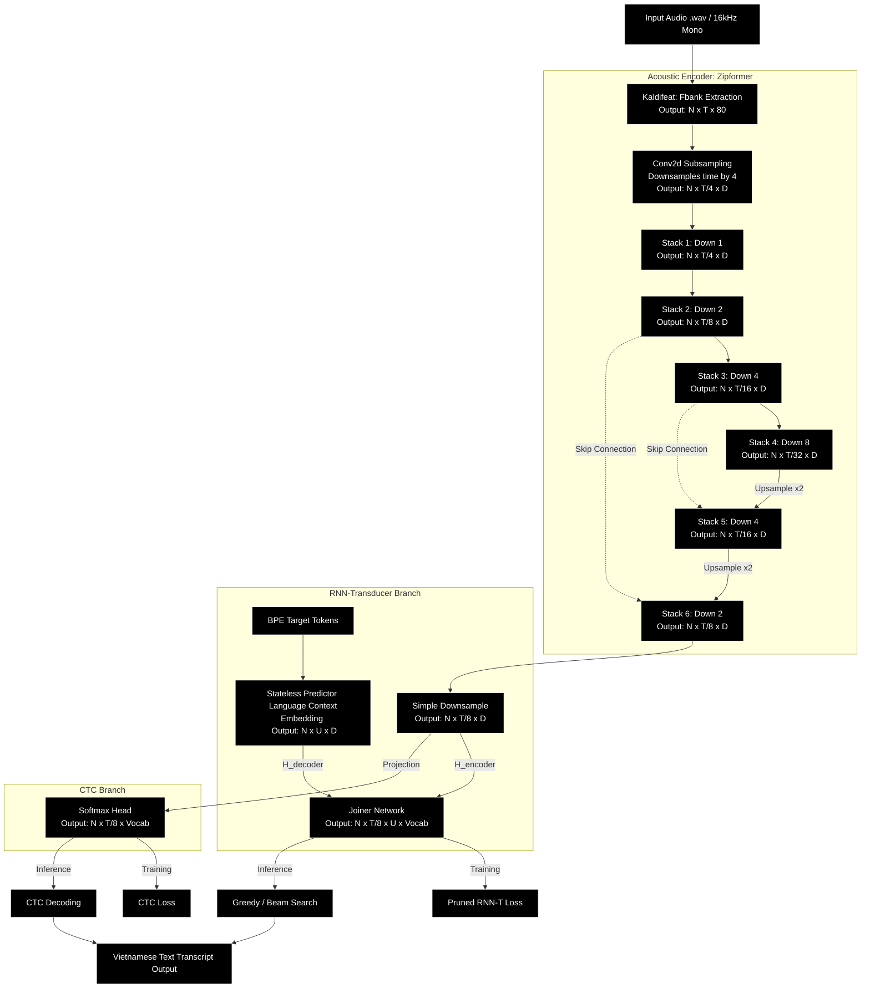

# VietASR Reference Manual: Architecture, Running Modes, and CLI Options

This guide provides a detailed analysis of the system architecture, data flow pipeline, operational running modes, and command-line configuration parameters of the VietASR speech recognition system.

---

## 1. System Architecture Diagram

Below is the detailed end-to-end data flow pipeline from the input audio to the output text, showing both the **RNN-Transducer (RNN-T)** and **CTC** decoding paths:

---

## 2. In-Depth Component Architecture

### 2.1. Feature Extraction (Kaldifeat)
*   **Role**: Converts continuous time-domain waveforms into digital frequency representations.
*   **Details**: Utilizes `kaldifeat` to compute 80-dimensional log-mel filter bank (Fbank) features. Each feature frame is extracted over a 25ms window with a 10ms frame shift. The input sample rate must be exactly 16kHz.

### 2.2. Acoustic Encoder (Zipformer)
Zipformer improves upon the traditional Conformer architecture using a **U-Net** topology and a **Multi-rate Downsampling** strategy:
*   **Complexity Reduction**: Traditional self-attention layers exhibit $O(T^2)$ computational complexity. By downsampling the time frames progressively through Stacks 1 to 4 (reaching an 8x reduction relative to the subsampled output, or 32x relative to the raw input), the self-attention complexity at the bottleneck (Stack 4) is reduced to $O(T^2 / 64)$.
*   **Skip Connections**: Feeds high-resolution features from the downsampling path directly to the corresponding upsampling layers (e.g., Stack 3 to Stack 5) to retain temporal precision and resolve acoustic ambiguities.

### 2.3. Stateless Predictor (Decoder)
*   **Difference from RNNs**: Unlike traditional autoregressive decoders that use recurrent LSTM/GRU layers, VietASR uses a **Stateless Predictor**.
*   **Mechanism**: Employs an `Embedding` layer followed by a limited set of non-recurrent 1D Convolution (`Conv1D`) layers to query history tokens. The lack of recurrent hidden states enables fast parallel execution and highly efficient caching during beam search.

### 2.4. Joiner Network
    The outputs are fed to a Softmax layer projecting over the vocabulary space (BPE tokens).

### 2.5. Connectionist Temporal Classification (CTC) Branch
Alongside the default Transducer branch, VietASR supports a CTC branch for joint training or independent inference:
*   **Mechanism**: The CTC branch directly projects the Encoder output $H_{\text{encoder}}$ onto the vocabulary space using a linear layer (`nn.Linear`) and computes `LogSoftmax` to generate independent token probability distributions for each time frame. This bypasses the Predictor and Joiner networks entirely.
*   **Characteristics**: Very fast inference speeds and a highly simplified model structure (relying solely on the Acoustic Encoder), making it suitable for resource-constrained edge devices.

### 2.6. Loss Functions & Decoding Mechanisms
*   **Pruned RNN-T Loss (smoothed & pruned)**:
    To overcome the $O(T \times U \times V)$ exponential GPU memory bottleneck of standard RNN-T loss, the Pruned RNN-T algorithm in `k2`/`icefall` executes a 3-step pruning strategy:
    1.  *Coarse Estimation (Simple Loss)*: Employs small linear projections (`simple_am_proj` and `simple_lm_proj`) to compute a lightweight alignment grid, yielding gradients to find the optimal path.
    2.  *Grid Pruning*: Based on the path with the highest probability, it restricts the search space to a narrow window of size `prune_range` (default $= 5$) around the optimal alignment.
    3.  *Fine Estimation (Pruned Loss)*: Evaluates the full Joiner probabilities only within this restricted path. This reduces the computational grid from the entire $T \times U$ matrix to $O(T \times \text{prune\_range})$, substantially minimizing GPU memory consumption and allowing larger batch sizes during training.
*   **CTC Loss**:
    *   Computes the sum of all possible valid alignment sequences between the acoustic representations and target labels. It introduces a blank token ($\varnothing$) and handles the collapse of consecutive identical characters automatically.
*   **CTC Decoding**:
    *   Applies Greedy Search or Prefix Beam Search to collapse identical adjacent tokens and filter out blank tokens ($\varnothing$) to reconstruct the final text transcript without needing a Predictor or Joiner network.

---

## 3. Operational Running Modes

### 3.1. Offline / Non-Streaming Mode (Batch)
*   **Configuration**: The default mode when `--causal 0` is set or left empty.
*   **Details**: The model accesses bidirectional temporal context (can see both future and past frames). The entire audio segment is transcribed at once, yielding the highest accuracy.

### 3.2. Online / Streaming Mode (Causal)
*   **Configuration**: Activated via `--causal 1`.
*   **Details**: Attention and convolution layers are causally masked so that the representation at step $t$ cannot access frames beyond $t' \le t$. Audio is processed sequentially in blocks defined by `--chunk-size` (default is `16` downsampled frames, ~640ms) with historical context constrained by `--left-context-frames` (default is `128` frames).

---

## 4. Decoding Search Algorithms

Inference decoding is configured using the `--method` CLI parameter:

### 4.1. Greedy Search (`greedy_search`)
*   **Process**: Evaluates and outputs the highest probability token at each time step.
*   **Details**: Fastest decoding path with $O(1)$ search complexity, though it may suffer from error propagation.

### 4.2. Modified Beam Search (`modified_beam_search`)
*   **Process**: Tracks a set of `beam-size` high-scoring hypotheses. Unlike standard beam search, it restricts the maximum number of symbols emitted per frame to prevent unnecessary search expansions.
*   **Details**: The default choice for optimal accuracy and benchmark evaluation.

### 4.3. Fast Beam Search (`fast_beam_search`)
*   **Process**: Traverses a simple decoding graph dynamically constructed using the C++ FST libraries of the `k2` engine.
*   **Details**: Highly optimized for GPU execution on larger batches.

---

## 5. CLI Configuration Reference Options

Below is a reference of the command-line options available in the primary inference script ([pretrained.py](../ASR/zipformer/pretrained.py)):

| Option | Type | Default | Description |
| :--- | :--- | :--- | :--- |
| `--checkpoint` | `str` | *Required* | Path to the PyTorch checkpoint file (e.g., `viet_iter3_pseudo_label/exp/epoch-12.pt`). |
| `--tokens` | `str` | *Required* | Path to the tokenizer mapping table file `tokens.txt`. |
| `--method` | `str` | `greedy_search` | Decoding search algorithm: `greedy_search`, `modified_beam_search`, or `fast_beam_search`. |
| `--sample-rate` | `int` | `16000` | Sample rate of the input sound file. VietASR expects `16000` Hz. |
| `--beam-size` | `int` | `4` | Number of hypotheses to maintain in `modified_beam_search`. |
| `--beam` | `float` | `4.0` | Cutoff score during beam search in `fast_beam_search`. |
| `--causal` | `int` | `0` | Set to `1` to enable streaming/causal model configuration. |
| `--chunk-size` | `str` | `16` | Decoding chunk size for streaming. |
| `--left-context-frames`| `str` | `128` | Left-context size limits for streaming attention queries. |

---

## 6. Directory and Key File Mapping

*   **[ASR/zipformer/pretrained.py](../ASR/zipformer/pretrained.py)**: The entry point for batch/offline inference on audio files.
*   **[ASR/zipformer/pretrained_ctc.py](../ASR/zipformer/pretrained_ctc.py)**: The entry point for CTC-based inference.
*   **[ASR/zipformer/zipformer.py](../ASR/zipformer/zipformer.py)**: Module defining the multi-rate downsampling Zipformer encoder blocks.
*   **[ASR/zipformer/decoder.py](../ASR/zipformer/decoder.py)**: Module defining the stateless BPE tokenizer predictor.
*   **[ASR/zipformer/joiner.py](../ASR/zipformer/joiner.py)**: Integrates encoder and predictor output tensors.
*   **[ASR/zipformer/beam_search.py](../ASR/zipformer/beam_search.py)**: Pure Python implementations of greedy, modified beam, and FST graph search decoders.
*   **[ASR/zipformer/train.py](../ASR/zipformer/train.py)**: Script managing model instantiation, parameter loading, and main training execution.
