# Đề Xuất Thiết Kế Hệ Thống: Tích Hợp Cơ Chế Mixture of Experts (MoE) Vào Kiến Trúc Zipformer

Tài liệu này trình bày thiết kế kỹ thuật chi tiết để tích hợp cơ chế **Mixture of Experts (MoE)** vào kiến trúc **Zipformer** hiện tại nhằm tối ưu hóa khả năng nhận dạng đa giọng địa phương (Bắc, Trung, Nam) của tiếng Việt trong mô hình VietASR.

---

## 1. So Sánh Trực Quan Kiến Trúc U-Net Đầu Cuối (End-to-End Horizontal Comparison)

Dưới đây là hai sơ đồ luồng dữ liệu được vẽ theo **chiều ngang (Horizontal - Left to Right)** giúp mô tả trực quan cấu trúc **U-Net** của Zipformer (các khối hạ mẫu sâu dần rồi nâng mẫu ngược lại kết hợp với kết nối tắt Skip Connections), kèm theo chi tiết các cổng vào/ra (In/Out) và kích thước chiều Tensor (Dimensions).

*Ký hiệu kích thước:*
*   $N$: Batch size (số lượng câu âm thanh trong một batch).
*   $T$: Số lượng khung thời gian (time frames) ban đầu của file `.wav` (tại phổ âm Fbank).
*   $D$: Số kênh nhúng (embedding dimension, mặc định là $384$).

---

### 1.1. Sơ Đồ Kiến Trúc Zipformer Gốc (Original U-Net Pipeline)

Trong mô hình gốc, luồng âm học đi qua kiến trúc hình chữ U với các kết nối tắt để khôi phục độ phân giải thời gian.

```mermaid
flowchart LR
    %% Định nghĩa các lớp phong cách cho Node
    classDef inputStyle fill:#e1f5fe,stroke:#0288d1,stroke-width:2px;
    classDef modelStyle fill:#fff3e0,stroke:#f57c00,stroke-width:2px;
    classDef lossStyle fill:#eceff1,stroke:#37474f,stroke-width:2px;

    %% Đầu vào & Front-end
    Wav[In: .wav Audio]:::inputStyle --> Fbank[Fbank Extraction <br> Out: N x T x 80]:::inputStyle
    Fbank --> Sub[Conv2d Subsampling <br> Out: N x T/4 x D]:::modelStyle

    %% U-Net Encoder Stacks
    subgraph U_Net_Encoder [Zipformer U-Net Encoder]
        Sub --> S1[Stack 1 <br> Down: 1 <br> Out: N x T/4 x D]:::modelStyle
        S1 --> S2[Stack 2 <br> Down: 2 <br> Out: N x T/8 x D]:::modelStyle
        S2 --> S3[Stack 3 <br> Down: 4 <br> Out: N x T/16 x D]:::modelStyle
        S3 --> S4[Stack 4 <br> Down: 8 <br> Out: N x T/32 x D]:::modelStyle
        
        %% Luồng nâng mẫu ngược lên
        S4 -->|Upsample x2| S5[Stack 5 <br> Down: 4 <br> Out: N x T/16 x D]:::modelStyle
        S5 -->|Upsample x2| S6[Stack 6 <br> Down: 2 <br> Out: N x T/8 x D]:::modelStyle
        
        %% Kết nối tắt Skip Connections (Đây là link thứ 8 và 9, đếm từ 0)
        S3 -.->|Skip Connection| S5
        S2 -.->|Skip Connection| S6
    end

    %% Downsample đầu ra & Giải mã
    S6 --> FinalDown[Simple Downsample <br> Out: N x T/8 x D]:::modelStyle
    FinalDown -->|H_encoder| Joiner[Joiner Network <br> Out: N x T/8 x U x Vocab]:::modelStyle
    
    Tokens[BPE Target Tokens] --> Dec[Stateless Predictor <br> Out: N x U x D]:::modelStyle
    Dec -->|H_decoder| Joiner
    
    Joiner --> Loss[Pruned RNN-T Loss]:::lossStyle

    %% Định nghĩa phong cách trực tiếp cho đường liên kết
    linkStyle 8,9 stroke:#388e3c,stroke-width:2px,stroke-dasharray: 5 5;
```



---

### 1.2. Sơ Đồ Kiến Trúc MoE-Zipformer Đề Xuất (Proposed MoE U-Net Pipeline)

Mô hình đề xuất thay thế mạng FFN của **Stack 4 (đáy U-Net)** và **Stack 5 (bắt đầu nâng mẫu)** bằng khối **Sparse MoE FFN** để học biểu diễn giọng địa phương tối ưu nhất.

```mermaid
flowchart LR
    %% Định nghĩa các lớp phong cách
    classDef inputStyle fill:#e1f5fe,stroke:#0288d1,stroke-width:2px;
    classDef modelStyle fill:#fff3e0,stroke:#f57c00,stroke-width:2px;
    classDef moeStyle fill:#e8f5e9,stroke:#2e7d32,stroke-width:2px;
    classDef lossStyle fill:#eceff1,stroke:#37474f,stroke-width:2px;

    %% Đầu vào & Front-end
    Wav[In: .wav Audio]:::inputStyle --> Fbank[Fbank Extraction <br> Out: N x T x 80]:::inputStyle
    Fbank --> Sub[Conv2d Subsampling <br> Out: N x T/4 x D]:::modelStyle

    %% MoE U-Net Encoder Stacks
    subgraph MoE_U_Net_Encoder [MoE-Zipformer U-Net Encoder]
        Sub --> S1[Stack 1 <br> Down: 1 <br> Out: N x T/4 x D]:::modelStyle
        S1 --> S2[Stack 2 <br> Down: 2 <br> Out: N x T/8 x D]:::modelStyle
        S2 --> S3[Stack 3 <br> Down: 4 <br> Out: N x T/16 x D]:::modelStyle
        
        %% Stack 4 đáy U-Net có MoE
        S3 --> S4_Att[Stack 4 Attention]:::modelStyle
        subgraph S4_MoE [Stack 4 MoE FFN Block]
            S4_Att --> S4_Router[Noisy Router]:::moeStyle
            S4_Router -->|Gating| S4_Exp1[Expert 1: North FFN]:::moeStyle
            S4_Router -->|Gating| S4_Exp2[Expert 2: Central FFN]:::moeStyle
            S4_Router -->|Gating| S4_Exp3[Expert 3: South FFN]:::moeStyle
            S4_Exp1 & S4_Exp2 & S4_Exp3 --> S4_Sum[Weighted Sum <br> Out: N x T/32 x D]:::moeStyle
        end
        
        %% Stack 5 nâng mẫu có MoE
        S4_Sum -->|Upsample x2| S5_Att[Stack 5 Attention]:::modelStyle
        subgraph S5_MoE [Stack 5 MoE FFN Block]
            S5_Att --> S5_Router[Noisy Router]:::moeStyle
            S5_Router -->|Gating| S5_Exp1[Expert 1: North FFN]:::moeStyle
            S5_Router -->|Gating| S5_Exp2[Expert 2: Central FFN]:::moeStyle
            S5_Router -->|Gating| S5_Exp3[Expert 3: South FFN]:::moeStyle
            S5_Exp1 & S5_Exp2 & S5_Exp3 --> S5_Sum[Weighted Sum <br> Out: N x T/16 x D]:::moeStyle
        end
        
        S5_Sum -->|Upsample x2| S6[Stack 6 <br> Down: 2 <br> Out: N x T/8 x D]:::modelStyle
        
        %% Kết nối tắt Skip Connections (link số 22 và 23)
        S3 -.->|Skip Connection| S5_Att
        S2 -.->|Skip Connection| S6
    end

    %% Downsample đầu ra & Giải mã
    S6 --> FinalDown[Simple Downsample <br> Out: N x T/8 x D]:::modelStyle
    FinalDown -->|H_encoder| Joiner[Joiner Network <br> Out: N x T/8 x U x Vocab]:::modelStyle
    
    Tokens[BPE Target Tokens] --> Dec[Stateless Predictor <br> Out: N x U x D]:::modelStyle
    Dec -->|H_decoder| Joiner
    
    %% Trích xuất Auxiliary Losses từ hai Router để cộng vào Loss tổng
    S4_Router & S5_Router -->|Collect Router States| AuxLoss[Importance & Load Loss Calculation]:::lossStyle
    
    Joiner --> MainLoss[Pruned RNN-T Loss]:::lossStyle
    MainLoss & AuxLoss --> TotalLoss[Total Loss = RNN-T Loss + alpha * Aux_Loss]:::lossStyle

    %% Liên kết phong cách trực tiếp cho skip connections
    linkStyle 22,23 stroke:#388e3c,stroke-width:2px,stroke-dasharray: 5 5;
```



---

## 2. Điểm Tích Hợp MoE Hợp Lý Nhất Trong Zipformer

Trong kiến trúc Transformer và Conformer/Zipformer truyền thống, phần chiếm nhiều tham số tĩnh nhất là mạng **Feed-Forward Network (FFN)**. 

Do đó, thiết kế chuẩn chỉ nhất là **thay thế khối FFN tiêu chuẩn trong một số Zipformer Blocks bằng khối Sparse MoE FFN**, trong đó mỗi "Expert" là một khối FFN độc lập.

### Lựa chọn vị trí đặt MoE Stacks:
Không nên thay thế toàn bộ FFN ở cả 6 Stacks bằng MoE vì sẽ làm tăng kích thước mô hình quá lớn và khó hội tụ. Khuyến nghị đặt MoE tại:
*   **Zipformer Stack 4 & 5**: Đây là các tầng trung tâm nơi biểu diễn âm học đã được nén sâu (downsampling factor 8 và 4), chứa nhiều thông tin ngữ nghĩa và đặc trưng giọng vùng miền rõ rệt nhất.
*   Giữ nguyên Stack 1, 2 (tầng nông học đặc trưng âm thanh vật lý thô) và Stack 6 (tầng tinh chỉnh đầu ra) để giữ mô hình gọn nhẹ.

---

## 3. Thiết Kế Chi Tiết Thành Phần MoE

### 3.1. Bộ Định Tuyến (Noisy Top-K Router)
Router nhận đầu vào $x \in \mathbb{R}^{d}$ (từ lớp Attention trước đó) và tính toán phân phối trọng số định tuyến cho $N$ Experts:

$$H(x)_i = (x \cdot W_g)_i + \epsilon \cdot \text{Softplus}((x \cdot W_{\text{noise}})_i)$$

Trong đó:
*   $W_g \in \mathbb{R}^{d \times N}$ là ma trận trọng số định tuyến.
*   $\epsilon \sim \mathcal{N}(0, 1)$ là nhiễu Gaussian ngẫu nhiên được thêm vào trong quá trình huấn luyện nhằm tạo tính khám phá (exploration) cho Router, tránh hiện tượng Router chỉ chọn duy nhất một miền giọng Bắc.
*   Ta chọn ra $K$ Experts có điểm số cao nhất (thường $K=1$ hoặc $K=2$ để tối ưu hóa tốc độ tính toán).

Trọng số Gating cuối cùng cho các Expert được chọn:
$$G(x) = \text{Softmax}(\text{KeepTopK}(H(x), K))$$

### 3.2. Khối Experts
Mỗi Expert $E_i(x)$ kế thừa trực tiếp thiết kế của lớp FFN trong Zipformer sử dụng cấu trúc Non-linear activation (Swoosh/ReLU) kết hợp với các tầng định biên (balancing layers) để đảm bảo độ ổn định gradient:

$$E_i(x) = \text{Linear}_2(\text{Activation}(\text{Linear}_1(x)))$$

Đầu ra cuối cùng của khối MoE FFN:
$$y = \sum_{i \in \text{Selected}} G(x)_i \cdot E_i(x)$$

---

## 4. Các Hàm Tổn Thất Bổ Trợ (Auxiliary Losses) để Cân Bằng Tải

Để ngăn ngừa hiện tượng nghẽn cổ chai (chỉ có 1 Expert được học còn các Expert khác bị bỏ đói), ta thêm vào hai hàm mất mát cân bằng tải vào `train.py`:

1.  **Importance Loss ($L_{\text{imp}}$)**: Khuyến khích tất cả Experts có tầm quan trọng tương đương nhau trên toàn bộ batch dữ liệu.
    $$L_{\text{imp}} = N \cdot \sum_{i=1}^{N} (F_i \cdot P_i)$$
    Trong đó $F_i$ là tỷ lệ tích lũy gating weights của expert $i$ trong batch, và $P_i$ là xác suất được chọn trung bình của expert $i$.
2.  **Load Loss ($L_{\text{load}}$)**: Khuyến khích số lượng sample được định tuyến đến mỗi Expert là đồng đều.

Trọng số tổng hợp trong quá trình huấn luyện:
$$\text{Loss}_{\text{total}} = \text{Loss}_{\text{RNN-T}} + 0.01 \cdot L_{\text{imp}} + 0.01 \cdot L_{\text{load}}$$

---

## 5. Kế Hoạch Thay Đổi Codebase Hiện Tại

Để tích hợp MoE vào VietASR, ta sẽ thực hiện 3 bước chỉnh sửa code chính:

### Bước 1: Khai báo Module MoE trong [ASR/zipformer/moe.py](../ASR/zipformer/moe.py) [NEW]
```python
import torch
import torch.nn as nn
import torch.nn.functional as F

class SparseMoE(nn.Module):
    def __init__(self, dim, num_experts=3, k=1):
        super().__init__()
        self.num_experts = num_experts
        self.k = k
        self.router = nn.Linear(dim, num_experts)
        # Khởi tạo danh sách các Experts kế thừa cấu trúc FFN gốc của Zipformer
        self.experts = nn.ModuleList([
            # CustomZipformerFFN(dim)
        ])
```

### Bước 2: Thay thế FFN trong [ASR/zipformer/zipformer.py](../ASR/zipformer/zipformer.py)
*   Tìm class `ZipformerBlock`.
*   Thay thế lớp FFN tiêu chuẩn bằng lớp `SparseMoE` tùy chọn dựa trên cấu hình tầng:
```python
# Trong __init__ của ZipformerBlock:
if use_moe:
    self.feed_forward = SparseMoE(dim=encoder_dim, num_experts=3, k=1)
else:
    self.feed_forward = FeedForward(dim=encoder_dim)
```

### Bước 3: Cập nhật hàm mất mát trong [ASR/zipformer/train.py](../ASR/zipformer/train.py)
*   Thu thập `aux_loss` được tích lũy từ các khối MoE trong quá trình forward của Encoder.
*   Cộng `aux_loss` vào loss chính trước khi thực hiện `backward()`.
