# System Design Proposal: Integrating Mixture of Experts (MoE) into Zipformer Architecture

This document presents the detailed technical design for integrating the **Mixture of Experts (MoE)** mechanism into the current **Zipformer** architecture. This modification aims to optimize the multi-dialect (Northern, Central, Southern) recognition capabilities of Vietnamese in the VietASR model.

---

## 1. End-to-End Visual Comparison of U-Net Architecture

The following data flow diagrams are drawn **horizontally (Left to Right)** to describe the **U-Net** structure of Zipformer (successive downsampling blocks followed by symmetric upsampling combined with skip connections), including detailed input/output ports and tensor dimension changes.

*Dimension notation:*
*   $N$: Batch size (number of audio utterances in a batch).
*   $T$: Number of initial time frames of the `.wav` file (at the Fbank spectrogram level).
*   $D$: Embedding dimension (default is $384$).

---

### 1.1. Original Zipformer Architecture (Original U-Net Pipeline)

In the original model, the acoustic representations flow through a U-shaped architecture with skip connections to restore temporal resolution.

```mermaid
flowchart LR
    %% Node style definitions
    classDef default fill:#000000,stroke:#ffffff,stroke-width:1px,color:#ffffff;
    classDef inputStyle fill:#000000,stroke:#ffffff,stroke-width:1px,color:#ffffff;
    classDef modelStyle fill:#000000,stroke:#ffffff,stroke-width:1px,color:#ffffff;
    classDef lossStyle fill:#000000,stroke:#ffffff,stroke-width:1px,color:#ffffff;

    %% Input & Front-end
    Wav[In: .wav Audio]:::inputStyle --> Fbank[Fbank Extraction <br> Out: N x T x 80]:::inputStyle
    Fbank --> Sub[Conv2d Subsampling <br> Out: N x T/4 x D]:::modelStyle

    %% U-Net Encoder Stacks
    subgraph U_Net_Encoder [Zipformer U-Net Encoder]
        Sub --> S1[Stack 1 <br> Down: 1 <br> Out: N x T/4 x D]:::modelStyle
        S1 --> S2[Stack 2 <br> Down: 2 <br> Out: N x T/8 x D]:::modelStyle
        S2 --> S3[Stack 3 <br> Down: 4 <br> Out: N x T/16 x D]:::modelStyle
        S3 --> S4[Stack 4 <br> Down: 8 <br> Out: N x T/32 x D]:::modelStyle
        
        %% Upsampling Flow
        S4 -->|Upsample x2| S5[Stack 5 <br> Down: 4 <br> Out: N x T/16 x D]:::modelStyle
        S5 -->|Upsample x2| S6[Stack 6 <br> Down: 2 <br> Out: N x T/8 x D]:::modelStyle
        
        %% Skip Connections
        S3 -.->|Skip Connection| S5
        S2 -.->|Skip Connection| S6
    end

    %% Output Downsampling & Decoding
    S6 --> FinalDown[Simple Downsample <br> Out: N x T/8 x D]:::modelStyle
    FinalDown -->|H_encoder| Joiner[Joiner Network <br> Out: N x T/8 x U x Vocab]:::modelStyle
    
    Tokens[BPE Target Tokens] --> Dec[Stateless Predictor <br> Out: N x U x D]:::modelStyle
    Dec -->|H_decoder| Joiner
    
    Joiner --> Loss[Pruned RNN-T Loss]:::lossStyle

    %% Link styles
    linkStyle 8,9 stroke:#388e3c,stroke-width:2px,stroke-dasharray: 5 5;
```



---

### 1.2. Proposed MoE-Zipformer Architecture (Proposed MoE U-Net Pipeline)

The proposed design replaces the FFN networks in **Stack 4 (bottom of the U-Net)** and **Stack 5 (start of upsampling)** with a **Sparse MoE FFN** block to learn optimal dialect representations.

```mermaid
flowchart LR
    %% Node style definitions
    classDef default fill:#000000,stroke:#ffffff,stroke-width:1px,color:#ffffff;
    classDef inputStyle fill:#000000,stroke:#ffffff,stroke-width:1px,color:#ffffff;
    classDef modelStyle fill:#000000,stroke:#ffffff,stroke-width:1px,color:#ffffff;
    classDef moeStyle fill:#000000,stroke:#ffffff,stroke-width:1px,color:#ffffff;
    classDef lossStyle fill:#000000,stroke:#ffffff,stroke-width:1px,color:#ffffff;

    %% Input & Front-end
    Wav[In: .wav Audio]:::inputStyle --> Fbank[Fbank Extraction <br> Out: N x T x 80]:::inputStyle
    Fbank --> Sub[Conv2d Subsampling <br> Out: N x T/4 x D]:::modelStyle

    %% MoE U-Net Encoder Stacks
    subgraph MoE_U_Net_Encoder [MoE-Zipformer U-Net Encoder]
        Sub --> S1[Stack 1 <br> Down: 1 <br> Out: N x T/4 x D]:::modelStyle
        S1 --> S2[Stack 2 <br> Down: 2 <br> Out: N x T/8 x D]:::modelStyle
        S2 --> S3[Stack 3 <br> Down: 4 <br> Out: N x T/16 x D]:::modelStyle
        
        %% Stack 4 bottom of U-Net with MoE
        S3 --> S4_Att[Stack 4 Attention]:::modelStyle
        subgraph S4_MoE [Stack 4 MoE FFN Block]
            S4_Att --> S4_Router[Noisy Router]:::moeStyle
            S4_Router -->|Gating| S4_Exp1[Expert 1: North FFN]:::moeStyle
            S4_Router -->|Gating| S4_Exp2[Expert 2: Central FFN]:::moeStyle
            S4_Router -->|Gating| S4_Exp3[Expert 3: South FFN]:::moeStyle
            S4_Exp1 & S4_Exp2 & S4_Exp3 --> S4_Sum[Weighted Sum <br> Out: N x T/32 x D]:::moeStyle
        end
        
        %% Stack 5 upsampling with MoE
        S4_Sum -->|Upsample x2| S5_Att[Stack 5 Attention]:::modelStyle
        subgraph S5_MoE [Stack 5 MoE FFN Block]
            S5_Att --> S5_Router[Noisy Router]:::moeStyle
            S5_Router -->|Gating| S5_Exp1[Expert 1: North FFN]:::moeStyle
            S5_Router -->|Gating| S5_Exp2[Expert 2: Central FFN]:::moeStyle
            S5_Router -->|Gating| S5_Exp3[Expert 3: South FFN]:::moeStyle
            S5_Exp1 & S5_Exp2 & S5_Exp3 --> S5_Sum[Weighted Sum <br> Out: N x T/16 x D]:::moeStyle
        end
        
        S5_Sum -->|Upsample x2| S6[Stack 6 <br> Down: 2 <br> Out: N x T/8 x D]:::modelStyle
        
        %% Skip Connections
        S3 -.->|Skip Connection| S5_Att
        S2 -.->|Skip Connection| S6
    end

    %% Output Downsampling & Decoding
    S6 --> FinalDown[Simple Downsample <br> Out: N x T/8 x D]:::modelStyle
    FinalDown -->|H_encoder| Joiner[Joiner Network <br> Out: N x T/8 x U x Vocab]:::modelStyle
    
    Tokens[BPE Target Tokens] --> Dec[Stateless Predictor <br> Out: N x U x D]:::modelStyle
    Dec -->|H_decoder| Joiner
    
    %% Auxiliary Losses from routers to add to the main loss
    S4_Router & S5_Router -->|Collect Router States| AuxLoss[Importance & Load Loss Calculation]:::lossStyle
    
    Joiner --> MainLoss[Pruned RNN-T Loss]:::lossStyle
    MainLoss & AuxLoss --> TotalLoss[Total Loss = RNN-T Loss + alpha * Aux_Loss]:::lossStyle

    %% Skip connections styling
    linkStyle 22,23 stroke:#388e3c,stroke-width:2px,stroke-dasharray: 5 5;
```



---

## 2. Rational Integration Points for MoE in Zipformer

In traditional Transformer and Conformer/Zipformer architectures, the component that consumes the most static parameters is the **Feed-Forward Network (FFN)**.

Therefore, the most standard integration design is to **replace the standard FFN block in selected Zipformer Blocks with a Sparse MoE FFN block**, where each "Expert" is an independent FFN block.

### Selection of MoE Stacks:
Replacing all FFN blocks across all 6 Stacks with MoE is not recommended because it would excessively increase the model size and hinder convergence. We recommend placing MoE in:
*   **Zipformer Stacks 4 & 5**: These are the central bottleneck layers where acoustic representations are deeply compressed (downsampling factors of 8 and 4). They contain rich semantic information and regional dialect-specific features.
*   Keep Stacks 1, 2 (shallow acoustic features) and Stack 6 (output fine-tuning) unmodified to keep the model lightweight.

---

## 3. Detailed Design of MoE Components

### 3.1. Routing Mechanism (Noisy Top-K Router)
The Router receives input $x \in \mathbb{R}^{d}$ (from the preceding Attention layer) and computes the routing weight distribution for $N$ Experts:

$$H(x)_i = (x \cdot W_g)_i + \epsilon \cdot \text{Softplus}((x \cdot W_{\text{noise}})_i)$$

Where:
*   $W_g \in \mathbb{R}^{d \times N}$ is the gating weight matrix.
*   $\epsilon \sim \mathcal{N}(0, 1)$ is a random Gaussian noise added during training to encourage exploration, preventing the Router from collapsing to a single dialect (e.g., Northern dialect).
*   We select the top $K$ Experts with the highest scores (typically $K=1$ or $K=2$ to optimize computation speed).

The final gating weights for the selected experts are computed as:
$$G(x) = \text{Softmax}(\text{KeepTopK}(H(x), K))$$

### 3.2. Expert Blocks
Each Expert $E_i(x)$ directly inherits the architecture of the FFN layer in Zipformer. It uses a non-linear activation (Swoosh/ReLU) combined with balancing layers to ensure gradient stability:

$$E_i(x) = \text{Linear}_2(\text{Activation}(\text{Linear}_1(x)))$$

The final output of the MoE FFN block is a weighted sum:
$$y = \sum_{i \in \text{Selected}} G(x)_i \cdot E_i(x)$$

---

## 4. Auxiliary Losses for Load Balancing

To prevent routing bottlenecks (where only one Expert is trained while others remain underutilized), we add two load-balancing auxiliary losses to `train.py`:

1.  **Importance Loss ($L_{\text{imp}}$)**: Encourages all Experts to have equal importance across the data batch.
    $$L_{\text{imp}} = N \cdot \sum_{i=1}^{N} (F_i \cdot P_i)$$
    Where $F_i$ is the ratio of accumulated gating weights for expert $i$ in the batch, and $P_i$ is the average selection probability of expert $i$.
2.  **Load Loss ($L_{\text{load}}$)**: Encourages an equal number of samples to be routed to each Expert.

Total consolidated loss during training:
$$\text{Loss}_{\text{total}} = \text{Loss}_{\text{RNN-T}} + 0.01 \cdot L_{\text{imp}} + 0.01 \cdot L_{\text{load}}$$

---

## 5. Codebase Modification Plan

To integrate MoE into VietASR, we will implement changes in 3 main phases:

### Phase 1: Define the MoE Module in [ASR/zipformer/moe.py](../ASR/zipformer/moe.py) [NEW]
```python
import torch
import torch.nn as nn
import torch.nn.functional as F

class SparseMoE(nn.Module):
    def __init__(self, dim, num_experts=3, k=1):
        super().__init__()
        self.num_experts = num_experts
        self.k = k
        self.router = nn.Linear(dim, num_experts)
        # Initialize Experts inheriting from the original Zipformer FFN structure
        self.experts = nn.ModuleList([
            # CustomZipformerFFN(dim)
        ])
```

### Phase 2: Replace FFN in [ASR/zipformer/zipformer.py](../ASR/zipformer/zipformer.py)
*   Locate the `ZipformerBlock` class.
*   Replace the standard FFN layer with the `SparseMoE` layer optionally based on the block configuration:
```python
# Inside ZipformerBlock.__init__:
if use_moe:
    self.feed_forward = SparseMoE(dim=encoder_dim, num_experts=3, k=1)
else:
    self.feed_forward = FeedForward(dim=encoder_dim)
```

### Phase 3: Update Loss Calculation in [ASR/zipformer/train.py](../ASR/zipformer/train.py)
*   Collect the accumulated `aux_loss` from all MoE blocks during the Encoder forward pass.
*   Add the `aux_loss` to the main loss prior to calling `backward()`.
