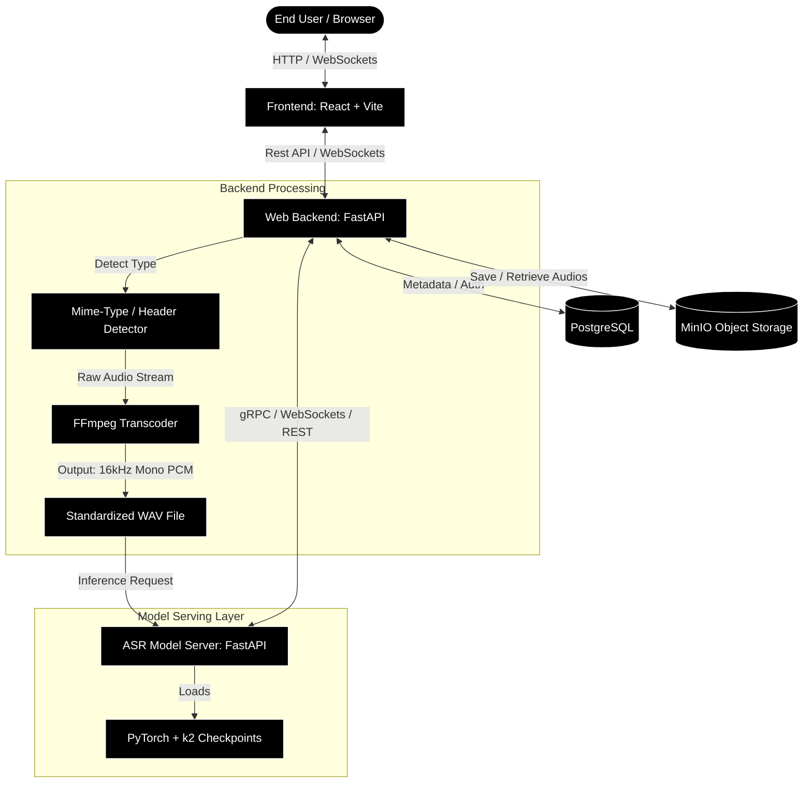

# Implementation Plan: Clean Architecture VietASR Web App (Monorepo)

This document details the refined technical architecture, technology stack, and implementation roadmap for building the VietASR web application based on the user's technology choices and requirements.

---

## 1. Chosen Technology Stack

Following the requirements, the system is designed to be fully open-source and easily orchestrated via Docker:

*   **ASR Model Server**: **Python (FastAPI)**.
    *   Directly loads the PyTorch / `k2` model checkpoints.
    *   Exposes lightweight endpoints for inference and WebSocket connections for real-time decoding.
*   **Web Backend**: **Python (FastAPI)**.
    *   Organized using **Clean Architecture** patterns.
    *   Exposes APIs to the frontend and acts as the gatekeeper.
    *   **Automated Audio Processing**: Automatically detects uploaded audio types and uses **FFmpeg** to transcode them into the target ASR format (16kHz, 1-channel, 16-bit PCM `.wav`).
*   **Frontend**: **React (Vite) + TailwindCSS + TypeScript**.
    *   A responsive single-page application (SPA).
    *   Provides user interfaces for file upload (displaying supported formats like `.wav`, `.mp3`, `.flac`, `.m4a`, `.ogg`, `.mp4`).
*   **Database**: **PostgreSQL**.
    *   Stores user credentials, transcription histories, metadata of files, alignment tokens, and dialect routing statistics.
*   **Audio Storage**: **MinIO** (Open-source, S3-compatible object storage).
    *   Configured and run easily via `docker-compose`. Stores raw `.wav` and `.mp3` files uploaded by users.

---

## 2. System Architecture Design



---

## 3. Audio Transcoding Pipeline Flow

When a user uploads a file:
1.  **Format Validation**: The Frontend displays supported formats (`.wav`, `.mp3`, `.m4a`, `.flac`, `.ogg`, `.mp4`).
2.  **Upload & Detection**: The file is sent via `multipart/form-data` to the FastAPI backend. The backend inspects the file headers and MIME type.
3.  **On-the-fly Transcoding**: The backend spawns an asynchronous `ffmpeg` process to convert the input stream to:
    *   **Format**: WAV (`pcm_s16le` / 16-bit PCM)
    *   **Sample Rate**: 16000 Hz (`-ar 16000`)
    *   **Channels**: 1 (Mono - `-ac 1`)
4.  **Storage & ASR Dispatch**: The standardized `.wav` file is saved to MinIO, and a copy of it is dispatched to the ASR Model Server for transcription.

---

## 4. Web Backend Code Structure (Clean Architecture)

The `apps/web-backend` directory will be structured as follows:

```
web-backend/
├── src/
│   ├── domain/               # Base business rules (Entities & Repository interfaces)
│   │   ├── entities.py       # User, AudioFile, Transcription, DialectStats
│   │   └── interfaces.py     # Base repository classes (DB and Storage ports)
│   ├── usecases/             # Application business rules
│   │   ├── transcribe.py     # TranscribeAudioUseCase (orchestrates flow)
│   │   ├── audio_process.py  # AudioProcessingUseCase (spawns FFmpeg conversion)
│   │   ├── auth.py           # User authentication logic
│   │   └── history.py        # GetUserHistoryUseCase
│   ├── adapters/             # Interface adapters (Controllers and Gateways)
│   │   ├── database/         # PostgreSQL implementations (SQLAlchemy models)
│   │   ├── storage/          # MinIO object storage client gateway
│   │   ├── asr_client/       # Client to connect to ASR Model Server
│   │   └── controllers.py    # Request validators and handlers
│   └── frameworks/           # Frameworks and drivers
│       ├── main.py           # FastAPI server entry point
│       ├── database.py       # SQLAlchemy engine and session initialization
│       └── routes/           # FastAPI routers (auth, audio, transcripts)
└── pyproject.toml
```

---

## 5. Implementation Roadmap

### Phase 1: Local Infrastructure Setup (Docker Orchestration)
1.  Create `docker-compose.yml` to provision:
    *   **PostgreSQL** (Port 5432)
    *   **MinIO** (Port 9000 for API, Port 9001 for Console)

### Phase 2: ASR Model Server Development
1.  Implement `apps/asr-server/` with FastAPI to load model checkpoints and perform inference on standardized `.wav` data.

### Phase 3: Web Backend Core & Audio Pipeline
1.  Implement `ffmpeg` transcoding logic inside `usecases/audio_process.py`.
2.  Set up MinIO storage bucket uploads.
3.  Expose `/api/upload` endpoint allowing multi-format uploads, transcode them to `.wav`, and return the transcription result.

### Phase 4: Frontend Development (React + Vite)
1.  Initialize `apps/web-frontend/` with React.
2.  Create drag-and-drop file uploader UI displaying supported formats.
3.  Implement the Settings panel allowing dynamic configuration of decoding parameters.

---

## 6. Dynamic ASR Configuration Protocol

To allow developers and users to adjust AI decoding parameters on-the-fly without restarting the servers, the system implements a dynamic configuration flow:

```
[React Frontend UI] --(Configs in Request Body)--> [FastAPI Web Backend] --(Relayed Configs)--> [FastAPI ASR Server]
  - method: greedy/beam                                                                              - Runs corresponding k2
  - beam_size: int                                                                                     decoding function with
  - causal: bool                                                                                       runtime variables
  - chunk_size/left_context
```

### 6.1. REST Endpoint Configuration (`POST /api/upload`)
The client can pass the desired parameters as part of the JSON metadata alongside the file upload request:
```json
{
  "decoding_config": {
    "method": "modified_beam_search",
    "beam_size": 4,
    "causal": false
  }
}
```

### 6.2. WebSocket Streaming Configuration (`WS /api/stream`)
Upon initiating the WebSocket connection, the client sends a handshake frame containing the initial decoding parameters:
```json
{
  "event": "handshake",
  "config": {
    "method": "greedy_search",
    "causal": true,
    "chunk_size": 16,
    "left_context_frames": 128
  }
}
```
The ASR Server will dynamically apply these variables to the decoding methods (`greedy_search_batch`, `modified_beam_search`, or `fast_beam_search_one_best`) at runtime without needing cold reboots.

