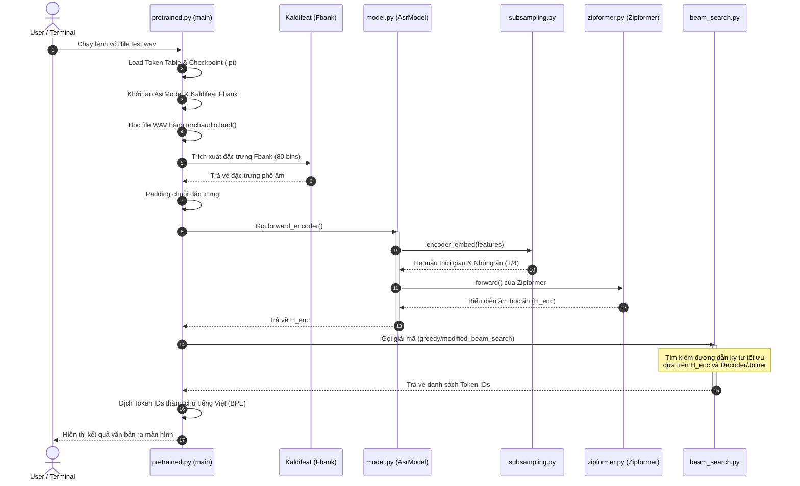

# Kiến Trúc Hệ Thống ASR Zipformer & Luồng Xử Lý Đầu Cuối (WAV-to-Text)

Tài liệu này cung cấp phân tích chi tiết về mặt toán học, lý thuyết mô hình, kiến trúc thành phần và luồng dữ liệu chi tiết từ file âm thanh đầu vào `.wav` đến văn bản đầu ra trong dự án VietASR.

---

## 1. Cơ Sở Toán Học & Lý Thuyết Mô Hình

### 1.1. Kiến Trúc Zipformer (Conformer Cải Tiến)
Zipformer là một kiến trúc cải tiến từ Conformer nhằm tối ưu hiệu năng tính toán và độ trễ bằng phương pháp **Multi-rate Downsampling (Hạ mẫu đa tốc độ)**.

Trong Conformer truyền thống, cơ chế Self-Attention có độ phức tạp tính toán là $O(T^2)$ với $T$ là chiều dài chuỗi thời gian. Zipformer giải quyết vấn đề này bằng cách hạ mẫu chuỗi thời gian ở các tầng giữa của Encoder rồi nâng mẫu trở lại ở các tầng cuối.

Kiến trúc gồm 6 stacks (nhóm khối) với các nhân tố hạ mẫu (downsampling factors) lần lượt là:
$$\text{Downsampling Factors} = (1, 2, 4, 8, 4, 2)$$

*   **Tầng giữa (Stack 4)**: Độ phân giải thời gian giảm đi 8 lần. Độ phức tạp tính toán của Self-Attention tại đây chỉ còn:
    $$O\left(\left(\frac{T}{8}\right)^2\right) = O\left(\frac{T^2}{64}\right)$$
*   **Module Nâng mẫu (Upsampling/Zip)**: Sử dụng phép nội suy tuyến tính kết hợp với tích chập để khôi phục lại chiều thời gian ban đầu, đồng thời kết hợp thông tin thông qua kết nối tắt (Skip Connections).

---

### 1.2. Lý Thuyết RNN-Transducer (RNN-T)
Mô hình ASR sử dụng cấu trúc RNN-T gồm ba mạng con: **Encoder (Acoustic Model)**, **Predictor (Language Model)**, và **Joiner**.

Cho chuỗi âm thanh đầu vào $\mathbf{x} = (x_1, \dots, x_T)$ và chuỗi nhãn đích $\mathbf{y} = (y_1, \dots, y_U)$.
*   **Encoder**: Biến đổi đặc trưng âm học đầu vào thành chuỗi trạng thái ẩn $\mathbf{h}^{\text{enc}} = \text{Encoder}(\mathbf{x})$ có độ dài $T$.
*   **Predictor**: Nhận các ký tự đã dự đoán trước đó và biến đổi thành chuỗi trạng thái ẩn $\mathbf{h}^{\text{dec}} = \text{Predictor}(\mathbf{y}_{1:u})$ có độ dài $U+1$.
*   **Joiner**: Kết hợp $\mathbf{h}^{\text{enc}}_t$ và $\mathbf{h}^{\text{dec}}_u$ để tính phân phối xác suất cho ký tự tiếp theo $z_{t, u}$:
    $$P(z_{t,u} \mid \mathbf{x}, \mathbf{y}_{1:u}) = \text{Softmax}(\text{Joiner}(\mathbf{h}^{\text{enc}}_t, \mathbf{h}^{\text{dec}}_u))$$
    Trong đó ký tự dự đoán $z_{t,u} \in \mathcal{V} \cup \{\varnothing\}$ (với $\mathcal{V}$ là từ điển và $\varnothing$ là ký tự trống - blank token).

---

### 1.3. Thuật Toán Pruned RNN-T Loss
RNN-T Loss truyền thống yêu cầu tính toán trên toàn bộ lưới trạng thái kích thước $T \times U$, dẫn đến việc tiêu tốn rất nhiều bộ nhớ GPU ($O(T \times U \times V)$).

**Pruned RNN-T Loss** (được phát triển trong dự án `k2` / `icefall`) giải quyết bài toán này qua 2 bước:
1.  **Bước 1: Tính toán thô (Simple Loss)**
    Sử dụng các phép chiếu tuyến tính đơn giản (nhỏ gọn) từ Encoder (`simple_am_proj`) và Predictor (`simple_lm_proj`) để tính ma trận xác suất rút gọn. Từ đó tính toán gradient và xác định các đường dẫn căn chỉnh (alignment paths) có xác suất cao nhất.
2.  **Bước 2: Cắt tỉa lưới (Pruning)**
    Chỉ giữ lại một dải hẹp xung quanh đường đi tối ưu với độ rộng là `prune_range` (mặc định $= 5$).
3.  **Bước 3: Tính toán chi tiết (Pruned Loss)**
    Thực hiện tính toán xác suất đầy đủ của mạng Joiner chính trên dải đã cắt tỉa. Điều này giảm không gian bộ nhớ từ $O(T \times U)$ xuống còn $O(T \times \text{prune\_range})$, cho phép tăng batch size khi huấn luyện lên gấp nhiều lần.

---

## 2. Chi Tiết Các File Trong Kiến Trúc

*   [subsampling.py](../ASR/zipformer/subsampling.py): Tích chập 2D (`Conv2dSubsampling`) giúp chuyển đổi phổ âm Fbank thành vector nhúng ẩn và hạ mẫu thời gian đi 4 lần ($T \to \lfloor \frac{T-7}{2} \rfloor$).
*   [zipformer.py](../ASR/zipformer/zipformer.py): Định nghĩa cấu trúc khối Zipformer chính, bao gồm cơ chế Self-Attention và Feed-Forward Network với các trọng số scaling đặc trưng.
*   [decoder.py](../ASR/zipformer/decoder.py): Định nghĩa mạng Predictor không trạng thái (Stateless Predictor) chỉ sử dụng các tầng nhúng Embedding và Conv1D không đệ quy để tối ưu tốc độ.
*   [joiner.py](../ASR/joiner.py): Kết hợp thông tin từ Encoder và Decoder thông qua phép cộng phi tuyến:
    $$\text{Joiner}(x, y) = \text{Linear}(\tanh(\text{Linear}(x) + \text{Linear}(y)))$$

---

## 3. Luồng Đi Chi Tiết Từ File `.wav` Đến Dự Đoán Văn Bản (WAV-to-Text)

Dưới đây là sơ đồ luồng thực thi đầy đủ khi bạn chạy file kiểm thử [pretrained.py](../ASR/zipformer/pretrained.py):

### Trace chi tiết từng bước:

#### Bước 1: Khởi động và chuẩn bị
*   **File**: [pretrained.py](../ASR/zipformer/pretrained.py) (Hàm `main()` dòng 256).
*   **Công việc**:
    1. Đọc danh sách ký tự từ file `tokens.txt` thông qua `k2.SymbolTable.from_file()`.
    2. Khởi tạo mô hình mạng `AsrModel` bằng hàm `get_model(params)` định nghĩa tại [train.py](../ASR/zipformer/train.py).
    3. Tải các tham số học được từ checkpoint `.pt` thông qua `torch.load()`.

#### Bước 2: Đọc file âm thanh và trích xuất đặc trưng
*   **File**: [pretrained.py](../ASR/zipformer/pretrained.py) (Hàm `read_sound_files` dòng 232).
*   **Công việc**: Dùng `torchaudio.load()` để đọc file `.wav`, ép tần số lấy mẫu về 16kHz, chỉ lấy channel đầu tiên (mono) và chuyển sang dạng tensor `float32`.
*   **Trích xuất Fbank**: Gọi `fbank(waves)` thông qua thư viện `kaldifeat`. Phổ âm Fbank (Filter bank) gồm 80 kênh tần số được trích xuất mỗi 25ms với bước nhảy 10ms (frame shift).

#### Bước 3: Đưa qua Encoder (Acoustic Modeling)
*   **File**: [model.py](../ASR/zipformer/model.py) (Hàm `forward_encoder` dòng 123).
*   **Công việc**:
    1. Đầu tiên, gọi `self.encoder_embed(x, x_lens)` (nằm trong [subsampling.py](../ASR/zipformer/subsampling.py)) thực hiện tích chập hạ mẫu thời gian đi 4 lần.
    2. Tiếp theo, tensor được chuyển vị trí trục và truyền vào `self.encoder` (nằm trong [zipformer.py](../ASR/zipformer/zipformer.py)). Trải qua 6 stack Zipformer để học các đặc trưng âm học ở nhiều độ phân giải khác nhau, tạo ra tensor ẩn $H_{\text{encoder}}$.

#### Bước 4: Giải mã (Decoding / Beam Search)
*   **File**: [beam_search.py](../ASR/zipformer/beam_search.py) (Hàm `modified_beam_search` hoặc `greedy_search_batch`).
*   **Công việc**:
    *   Tại mỗi bước thời gian $t$, biểu diễn âm học $H_{\text{encoder}}[t]$ được đưa qua Joiner.
    *   Joiner kết hợp nó với dự đoán trước đó của Predictor (`decoder.py`) để tính xác suất cho các ký tự tiếp theo.
    *   Thuật toán Beam Search duy trì một nhóm các giả thuyết (hypotheses) có điểm số cao nhất. Nếu ký tự trống $\varnothing$ được dự đoán, mô hình sẽ chuyển sang khung thời gian tiếp theo $t+1$.

#### Bước 5: Chuyển đổi Token sang Văn bản
*   **File**: [pretrained.py](../ASR/zipformer/pretrained.py) (Hàm `token_ids_to_words` dòng 328).
*   **Công việc**: Tra cứu danh sách Token IDs nhận được sau khi giải mã qua `SymbolTable` để chuyển thành các cụm từ BPE. Ký tự phân tách từ `▁` được thay thế bằng khoảng trắng để tạo thành câu hoàn chỉnh và hiển thị kết quả văn bản tiếng Việt lên màn hình.
