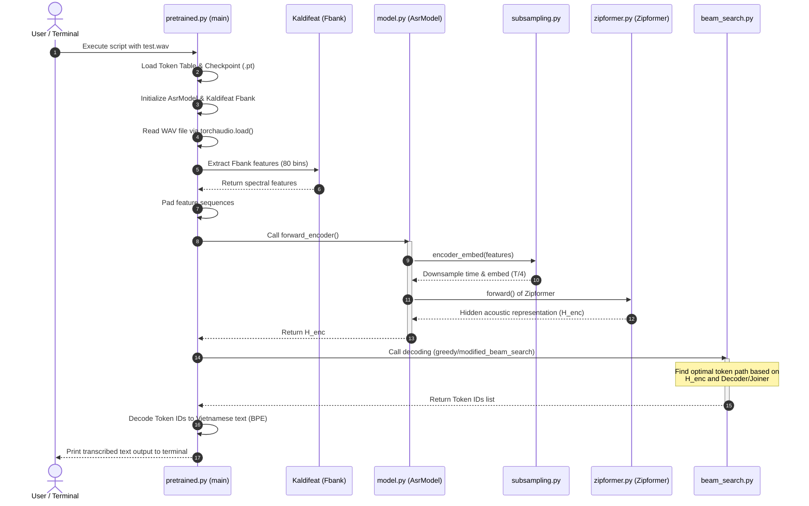

# Zipformer ASR System Architecture & End-to-End Processing Flow (WAV-to-Text)

This document provides a detailed analysis of the mathematical foundations, model theory, component architecture, and data flow pipeline from the input audio file (`.wav`) to the output transcript in the VietASR project.

---

## 1. Mathematical Foundations & Model Theory

### 1.1. Zipformer Architecture (Improved Conformer)
Zipformer is an advanced variant of the Conformer architecture designed to optimize computational efficiency and inference latency using **Multi-rate Downsampling**.

In traditional Conformers, the Self-Attention mechanism exhibits a computational complexity of $O(T^2)$, where $T$ represents the sequence length. Zipformer mitigates this bottleneck by downsampling the temporal resolution in the intermediate stacks of the Encoder and upsampling it back in the final stacks.

The architecture consists of 6 stacks with the following downsampling factors:
$$\text{Downsampling Factors} = (1, 2, 4, 8, 4, 2)$$

*   **Intermediate Layer (Stack 4)**: The temporal resolution is reduced by a factor of 8. The computational complexity of Self-Attention at this layer is reduced to:
    $$O\left(\left(\frac{T}{8}\right)^2\right) = O\left(\frac{T^2}{64}\right)$$
*   **Upsampling Module (Zip)**: Restores the original temporal dimensions using linear interpolation combined with convolution, while retaining multi-resolution representations through Skip Connections.

---

### 1.2. RNN-Transducer (RNN-T) Theory
The ASR model employs an RNN-T framework consisting of three sub-networks: the **Encoder (Acoustic Model)**, the **Predictor (Language Model)**, and the **Joiner**.

Given an input acoustic sequence $\mathbf{x} = (x_1, \dots, x_T)$ and target token sequence $\mathbf{y} = (y_1, \dots, y_U)$:
*   **Encoder**: Maps the input acoustic features to a sequence of hidden representations $\mathbf{h}^{\text{enc}} = \text{Encoder}(\mathbf{x})$ of length $T$.
*   **Predictor**: Receives the history of predicted non-blank tokens and transforms them into representations $\mathbf{h}^{\text{dec}} = \text{Predictor}(\mathbf{y}_{1:u})$ of length $U+1$.
*   **Joiner**: Combines acoustic representation $\mathbf{h}^{\text{enc}}_t$ and prediction representation $\mathbf{h}^{\text{dec}}_u$ to compute the probability distribution of the next token $z_{t, u}$:
    $$P(z_{t,u} \mid \mathbf{x}, \mathbf{y}_{1:u}) = \text{Softmax}(\text{Joiner}(\mathbf{h}^{\text{enc}}_t, \mathbf{h}^{\text{dec}}_u))$$
    Where the predicted token $z_{t,u} \in \mathcal{V} \cup \{\varnothing\}$ (with $\mathcal{V}$ as the vocabulary and $\varnothing$ as the blank token).

---

### 1.3. Pruned RNN-T Loss Algorithm
Standard RNN-T loss calculation requires computing values over the entire $T \times U$ grid, which demands a large amount of GPU memory ($O(T \times U \times V)$).

**Pruned RNN-T Loss** (developed in the `k2` / `icefall` project) optimizes this computation through three phases:
1.  **Phase 1: Coarse Estimation (Simple Loss)**
    Uses low-rank linear projections from the Encoder (`simple_am_proj`) and Predictor (`simple_lm_proj`) to compute a lightweight alignment grid, yielding gradients to identify the most probable alignment paths.
2.  **Phase 2: Grid Pruning**
    Restricts the search grid to a narrow band around the optimal path with a width defined by `prune_range` (default $= 5$).
3.  **Phase 3: Fine Estimation (Pruned Loss)**
    Computes the full Joiner probabilities only within the pruned search space. This reduces the memory footprint from $O(T \times U)$ to $O(T \times \text{prune\_range})$, enabling significantly larger training batch sizes.

---

## 2. File Details within the Architecture

*   [subsampling.py](../ASR/zipformer/subsampling.py): Implements 2D Convolutional Subsampling (`Conv2dSubsampling`) to convert Fbank spectrograms into dense embeddings while reducing temporal resolution by a factor of 4 ($T \to \lfloor \frac{T-7}{2} \rfloor$).
*   [zipformer.py](../ASR/zipformer/zipformer.py): Defines the primary Zipformer stack blocks, including multi-head self-attention and Feed-Forward Networks utilizing custom scaling factors.
*   [decoder.py](../ASR/zipformer/decoder.py): Defines a stateless predictor (Stateless Predictor) using non-recurrent Embedding and Conv1D layers to minimize latency.
*   [joiner.py](../ASR/joiner.py): Blends features from the Encoder and Decoder using a non-linear addition network:
    $$\text{Joiner}(x, y) = \text{Linear}(\tanh(\text{Linear}(x) + \text{Linear}(y)))$$

---

## 3. Detailed Data Flow from .wav File to Text Prediction (WAV-to-Text)

The sequence diagram below traces the execution flow when running the decoding script [pretrained.py](../ASR/zipformer/pretrained.py):

### Sequential Trace Details:

#### Step 1: Startup and Initialization
*   **File**: [pretrained.py](../ASR/zipformer/pretrained.py) (Inside `main()` at line 256).
*   **Operations**:
    1. Loads the token mapping table from `tokens.txt` using `k2.SymbolTable.from_file()`.
    2. Initializes the `AsrModel` structure using the `get_model(params)` helper in [train.py](../ASR/zipformer/train.py).
    3. Loads the learned weights from the `.pt` checkpoint using `torch.load()`.

#### Step 2: Audio Loading and Feature Extraction
*   **File**: [pretrained.py](../ASR/zipformer/pretrained.py) (Inside `read_sound_files` at line 232).
*   **Operations**: Reads the audio file using `torchaudio.load()`, resamples it to 16kHz (mono channel), and converts it into a `float32` tensor.
*   **Fbank Extraction**: Passes the wave tensor to `fbank(waves)` from `kaldifeat`. 80-dimensional log-mel filter bank features are extracted using a 25ms window and 10ms frame shift.

#### Step 3: Acoustic Encoder Processing
*   **File**: [model.py](../ASR/zipformer/model.py) (Inside `forward_encoder` at line 123).
*   **Operations**:
    1. Invokes `self.encoder_embed(x, x_lens)` in [subsampling.py](../ASR/zipformer/subsampling.py) to perform a 2D convolution that downsamples the time axis by 4.
    2. Transposes the dimensions and inputs the representations into `self.encoder` defined in [zipformer.py](../ASR/zipformer/zipformer.py). The tensor goes through the 6 Zipformer stacks, resulting in the acoustic representation $H_{\text{encoder}}$.

#### Step 4: Decoding & Search
*   **File**: [beam_search.py](../ASR/zipformer/beam_search.py) (Using `modified_beam_search` or `greedy_search_batch`).
*   **Operations**:
    *   At each downsampled time frame $t$, the acoustic frame representation $H_{\text{encoder}}[t]$ is sent to the Joiner.
    *   The Joiner merges it with the predicted history state from the Predictor (`decoder.py`) to estimate token probabilities.
    *   The Beam Search algorithm maintains a set of high-scoring hypotheses. If a blank token $\varnothing$ is predicted, it increments the time step to $t+1$.

#### Step 5: Token to Text Conversion
*   **File**: [pretrained.py](../ASR/zipformer/pretrained.py) (Inside `token_ids_to_words` at line 328).
*   **Operations**: Map the predicted token IDs back to human-readable strings via the `SymbolTable` to reconstruct BPE words. Words are stitched together, replacing word boundary markers `▁` with spaces, to display the final Vietnamese text transcript to the user.
